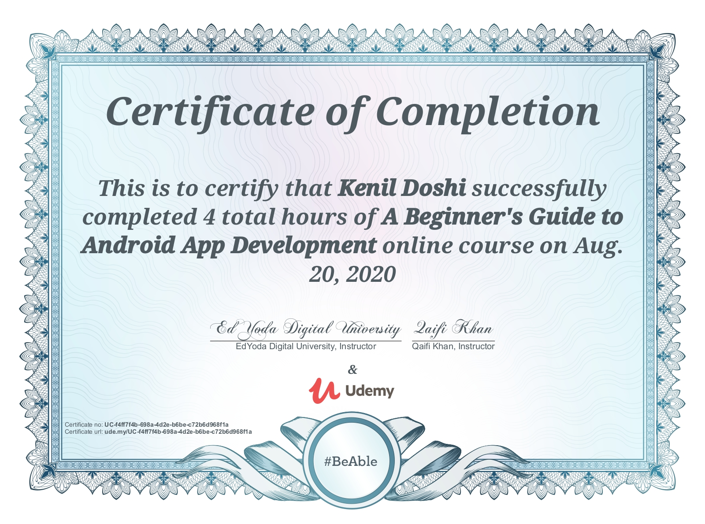
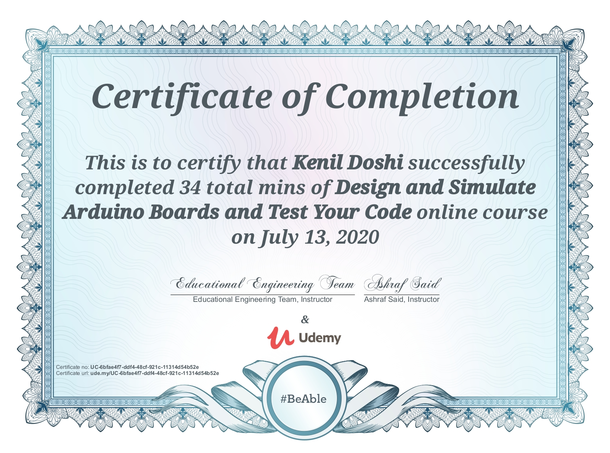
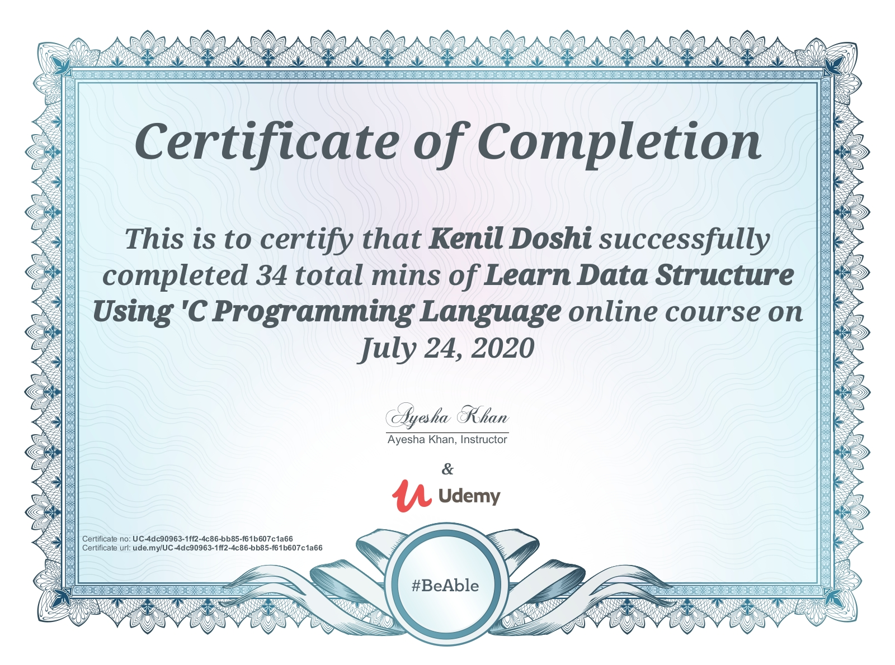

# 🏆 LIFE-TIME CERTIFICATES

> A digital vault of learning, architecture battles, debugging marathons, leadership evolution, and endless curiosity 🚀
> 
> Curated constellation of certifications earned through continuous learning, real-world engineering practice, architectural exploration, leadership growth, and relentless curiosity across Android, Kotlin, Software Architecture, Web Development, Communication, and Modern Engineering ecosystems 🚀📚

---

# 💻 TECHNOLOGY

---

# 🤖 Android Development

### 1. Android Unit Testing and Test Driven Development
#### 📌 Tech Stack:
`Android` • `Unit Testing` • `TDD`

---

### 2. Learn the latest Android technologies including Dagger2, MVVM, Kotlin, RxJava, Retrofit, Mockito and Glide
#### 📌 Tech Stack:
`Android` • `MVVM` • `Dagger2` • `RxJava` • `Retrofit`

---

### 3. Master Android app development (Kotlin) with Clean Architecture, TDD, HILT, Espresso & Unit Testing
#### 📌 Tech Stack:
`Android` • `Kotlin` • `Clean Architecture` • `HILT` • `Espresso`

---

### 4. Modern Android app using Java, MVVM, Dagger2, RxJava & more
#### 📌 Tech Stack:
`Android` • `Java` • `MVVM` • `RxJava`

---

### 5. Modern Android Architectures - MVVM MVP MVC - in Java
#### 📌 Tech Stack:
`Android` • `MVVM` • `MVP` • `MVC`

---

### 6. Jetpack Compose Crash Course for Android with Kotlin
#### 📌 Tech Stack:
`Jetpack Compose` • `Android` • `Kotlin`

---

### 7. Android TDD Masterclass - Coroutines, Jetpack
#### 📌 Tech Stack:
`Android` • `TDD` • `Coroutines` • `Jetpack`

---

### 8. Android Development from [Board Infinity]
#### 📌 Tech Stack:
`Android` • `TDD` • `Coroutines` • `Jetpack`

---

### 9. Beginner Guide to Android App Development 
#### 📌 Tech Stack:
`Android` • `TDD` • `Coroutines` • `Jetpack`

---

# 🔌 Embedded Systems & IoT

### 1. Design and Simulate Arduino Boards and Test Your Code
#### 📌 Skills:
`Arduino` • `Embedded Systems` • `Simulation` • `IoT`

---

# 💻 Programming Languages

### 1. C Programming
#### 📌 Skills:
`C Programming` • `Programming Fundamentals` • `Problem Solving`

---

# 🍏 iOS Development

### 1. Build Kotlin Multiplatform Mobile Apps for iOS and Android
#### 📌 Tech Stack:
`iOS` • `KMM` • `Cross Platform`

---

# 🌉 Cross Platform Development

### 1. Build Kotlin Multiplatform Mobile Apps for iOS and Android
#### 📌 Tech Stack:
`KMM` • `Android` • `iOS` • `Cross Platform`

---

# ☕ Kotlin & Java Development

### 1. 60-Minute Kotlin Quick Start for Java Developers
#### 📌 Tech Stack:
`Kotlin` • `Java`

---

### 2. Kotlin for Beginners: Learn Programming With Kotlin
#### 📌 Tech Stack:
`Kotlin`

---

### 3. Complete Kotlin Development Masterclass
#### 📌 Tech Stack:
`Kotlin` • `Advanced Development`

---

### 4. Build fully functional applications with Spring Boot and Kotlin
#### 📌 Tech Stack:
`Spring Boot` • `Kotlin` • `Backend`

---

# 🌐 Web Development

### 1. The most in-depth course on ES6 around
#### 📌 Tech Stack:
`JavaScript` • `ES6` • `React` • `Webpack`

---

# 🛠️ Software Architecture & Engineering

### 1. SOLID Principles of Object Oriented Design and Architecture
#### 📌 Tech Stack:
`SOLID` • `Architecture` • `OOP`

---

### 2. SOLID Principles: Introducing Software Architecture & Design
#### 📌 Tech Stack:
`Software Architecture` • `Design Patterns`

---

### 3. SDLC Overview (1 Hour) - Software Development Life Cycle
#### 📌 Tech Stack:
`SDLC` • `Software Engineering`

---

# 🔧 Version Control & Tools

### 1. Git Going Fast: One Hour Git Crash Course
#### 📌 Tech Stack:
`Git` • `Version Control`

---

### 2. Learn Git by Doing: A step-by-step guide to version control
#### 📌 Tech Stack:
`Git` • `Version Control`

---

# 🗣️ COMMUNICATION

### 1. Communication Skills for Professionals
#### 📌 Skills:
`Communication` • `Professional Skills`

---

# 📊 MANAGEMENT & LEADERSHIP

### 1. Think Like a Leader with Brian Tracy
#### 📌 Skills:
`Leadership` • `Management`

---

### 2. Smart Tips: Leadership
#### 📌 Skills:
`Leadership`

---

### 3. Management & Leadership
#### 📌 Skills:
`Management` • `Leadership`

---

### 4. How to Become a Senior Developer - Beyond Coding Skills
#### 📌 Skills:
`Leadership` • `Career Growth` • `Senior Engineering`

---

# 📈 PROFESSIONAL GROWTH

### 1. The Upskilling Imperative
#### 📌 Skills:
`Upskilling` • `Career Development`

---
